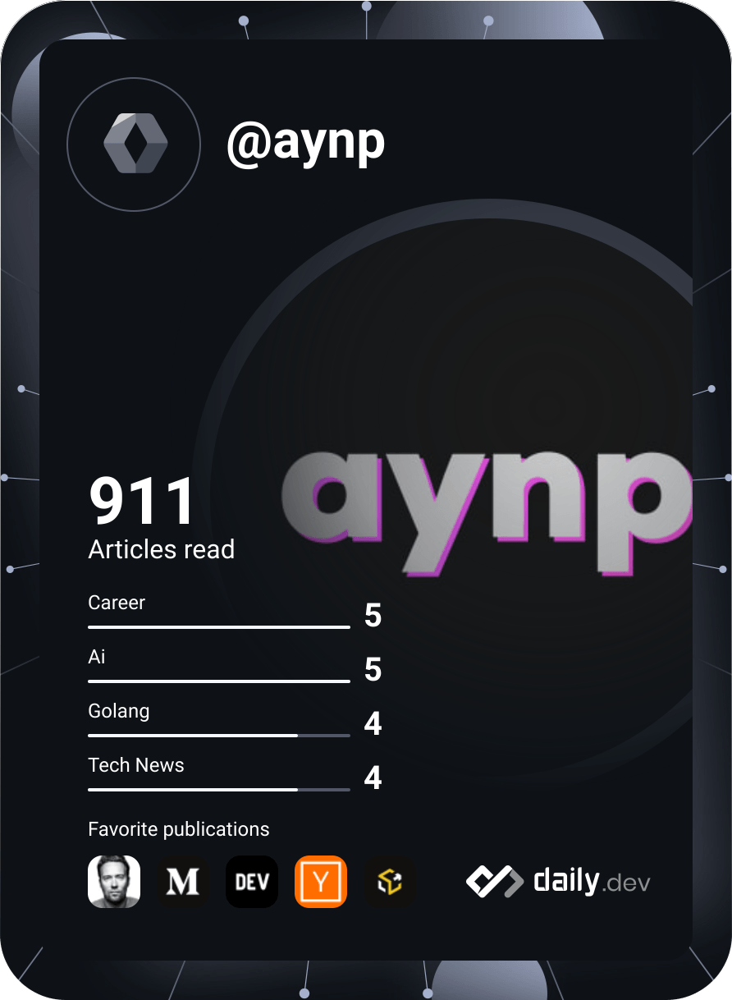

# Hi there 👋

<!--  -->

<!-- 
 -->
  
<!-- 
 -->

## I'm Aryan Pathania

A 3rd year Computer Science and Engineering student at National Institute of Technology, Hamirpur.

## Profile Links

-   **Portfolio - [aynp.vercel.app](https://aryanpathania.vercel.app)**
-   **GitHub - [aynp](https://github.com/aynp)**
-   **LinkedIn - [aryanpathania03](https://www.linkedin.com/in/aryanpathania03)**
-   **Twitter - [aryanpathania03](https://twitter.com/aryanpathania03)**
-   **Codeforces - [nand](https://codeforces.com/profile/nand)**

<!--
**aynp/aynp** is a ✨ _special_ ✨ repository because its `README.md` (this file) appears on your GitHub profile.

Here are some ideas to get you started:

- 🔭 I’m currently working on ...
- 🌱 I’m currently learning ...
- 👯 I’m looking to collaborate on ...
- 🤔 I’m looking for help with ...
- 💬 Ask me about ...
- 📫 How to reach me: ...
- 😄 Pronouns: ...
- ⚡ Fun fact: ...
-->
